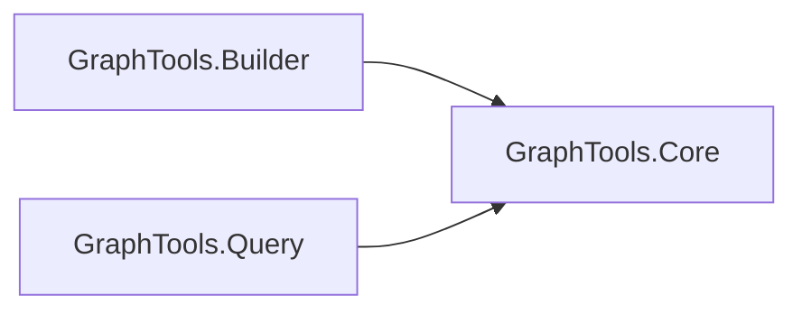

# Code Summary

GraphTools is a .NET 8 console-tool suite that uses Roslyn (Microsoft.CodeAnalysis.Workspaces.MSBuild)
to extract a symbol/dependency graph from a .NET solution, persist it as JSON, and query it.

## Project Dependency Graph

## Symbol Index

### GraphTools.Core
| Symbol | File | Responsibility |
|---|---|---|
| `WorkspaceLoader` | GraphTools.Core/WorkspaceLoader.cs | Opens a solution via `MSBuildWorkspace`, reports load progress. |
| `GraphExtractor` | GraphTools.Core/GraphExtractor.cs | Walks Roslyn compilation symbols (namespaces/types/members) to build `GraphNode`/`GraphEdge` lists (extends, calls, etc.). |
| `ProjectDependencyExtractor` | GraphTools.Core/ProjectDependencyExtractor.cs | Extracts project-to-project reference graph from a `Solution`. |
| `JsonHelper` | GraphTools.Core/JsonHelper.cs | Camel-case JSON (de)serialization helpers for reading/writing graph files. |
| `PathUtils` | GraphTools.Core/PathUtils.cs | Detects paths under `bin`/`obj` build-output folders to exclude generated files. |
| `Models` (GraphNode, GraphEdge, FullGraph, ProjectDependency, ProjectDependencies, DiffReport, ModifiedNode, EdgeKey) | GraphTools.Core/Models.cs | Data contracts for the graph, project deps, and diff report, serialized to JSON. |

### GraphTools.Builder
| Symbol | File | Responsibility |
|---|---|---|
| `Program` (top-level) | GraphTools.Builder/Program.cs | CLI entry point: builds a full or incremental graph (`--solution`, `--output`, `--mode incremental --graph`) and can diff two graphs (`--diff`). |

### GraphTools.Query
| Symbol | File | Responsibility |
|---|---|---|
| `Program` (top-level) | GraphTools.Query/Program.cs | CLI entry point: loads a graph JSON file and answers queries (`--symbol`, `--direction callers|callees`, `--list-symbols --project`). |

## Key Flows

- **Full build**: `Builder.Program` -> `WorkspaceLoader.LoadSolutionAsync` -> `GraphExtractor.ExtractProjectAsync` (per project) -> `JsonHelper.WriteToFile` (full-graph.json) -> `ProjectDependencyExtractor.Extract` -> `JsonHelper.WriteToFile` (project-dependencies.json).
- **Incremental build**: `Builder.Program` -> load existing graph -> detect changed files (mtime > `GeneratedAt`, excluding `PathUtils.IsInBuildOutputFolder`) -> re-extract only affected projects -> merge nodes/edges by file path -> write merged graph.
- **Diff**: `Builder.Program --diff` -> load two `FullGraph` files -> compare `Nodes`/`Edges` by id/key -> produce `DiffReport` (added/removed/modified).
- **Query**: `Query.Program` -> `JsonHelper.ReadFromFile<FullGraph>` -> filter `Nodes`/`Edges` by symbol id, direction, or project -> print JSON result.
